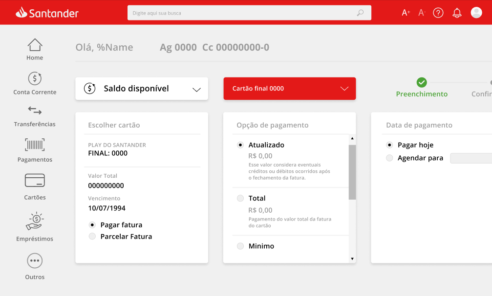
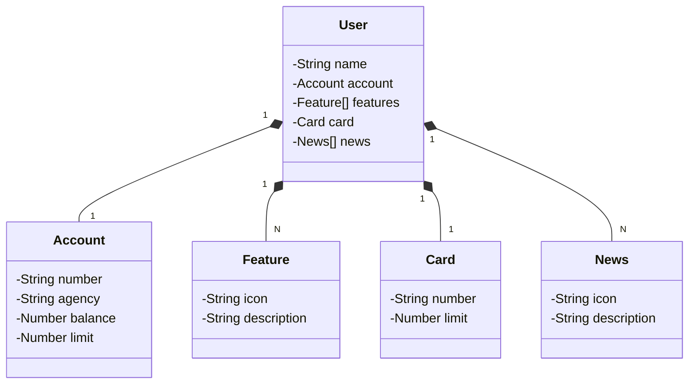

# Santander Bootcamp 2023 - Fullstack Java+Angular | Digital Innovation One 

## Lab Project 
*Publicando Sua API REST na Nuvem Usando Spring Boot 3, Java 17 e Railway*

**Descrição:** Vamos mergulhar diretamente no universo do desenvolvimento e construir uma API REST do zero! E o melhor de tudo, faremos isso utilizando o Java 17, a versão LTS mais recente que está recheada de novidades empolgantes. Para tornar a nossa jornada ainda mais produtiva, vamos empregar o poder do Spring Boot 3, que é amplamente conhecido por potencializar a produtividade dos desenvolvedores através de sua incrível capacidade de autoconfiguração. Mas não para por aí, vamos simplificar ainda mais o acesso aos bancos de dados SQL com o auxílio do Spring Data JPA. Durante nosso percurso, também vamos tratar da importância de uma documentação de API bem construída e fácil de compreender, para isso, vamos usar o OpenAPI, também conhecido como Swagger. Para finalizar nosso projeto, vamos usar o Railway, uma plataforma que torna o Deploy de soluções na nuvem muito mais simples. Assim, podemos nos concentrar no que realmente importa: o desenvolvimento das nossas soluções!

## Principais Tecnologias
 - **Java 17**: Utilizaremos a versão LTS mais recente do Java para tirar vantagem das últimas inovações que essa linguagem robusta e amplamente utilizada oferece;
 - **Spring Boot 3**: Trabalharemos com a mais nova versão do Spring Boot, que maximiza a produtividade do desenvolvedor por meio de sua poderosa premissa de autoconfiguração;
 - **Spring Data JPA**: Exploraremos como essa ferramenta pode simplificar nossa camada de acesso aos dados, facilitando a integração com bancos de dados SQL;
 - **OpenAPI (Swagger)**: Vamos criar uma documentação de API eficaz e fácil de entender usando a OpenAPI (Swagger), perfeitamente alinhada com a alta produtividade que o Spring Boot oferece;
 - **Railway**: facilita o deploy e monitoramento de nossas soluções na nuvem, além de oferecer diversos bancos de dados como serviço e pipelines de CI/CD.

## Layout

### [Link do Figma](https://www.figma.com/file/0ZsjwjsYlYd3timxqMWlbj/SANTANDER---Projeto-Web%2FMobile?type=design&node-id=1421-432&mode=design)

## Diagrama de classes (Domínio da API)

## Notas
- JSON Editor Online: Para organizar a abstração do layout (ex: Figma) em possíveis entidades.
  - Arquivo: "./drafts/layout-to-abstraction.json"
- ChatGPT: Pegar o .json criado e gerar um diagrama de classes (UML) para o projeto.
  - Prompt: "Gere um diagrama de classes (usando a sintaxe Mermaid) tendo em vista o seguinte JSON que representa um usuário de um banco. Mantenha o idioma das classes em inglês. Mantenha uma estrutura simples e fiel ao modelo que vou passar: [Cole o conteúdo criado no JSON] ."
  - Arquivo: "./drafts/classes-diagram.txt"

